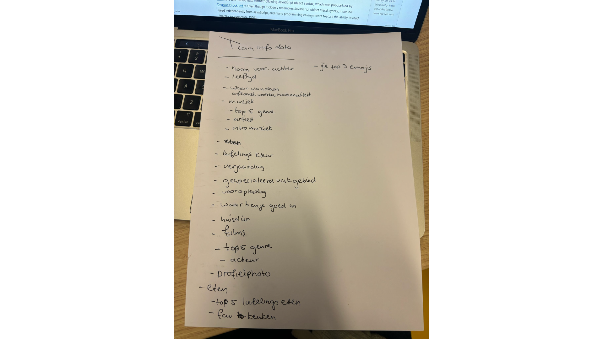
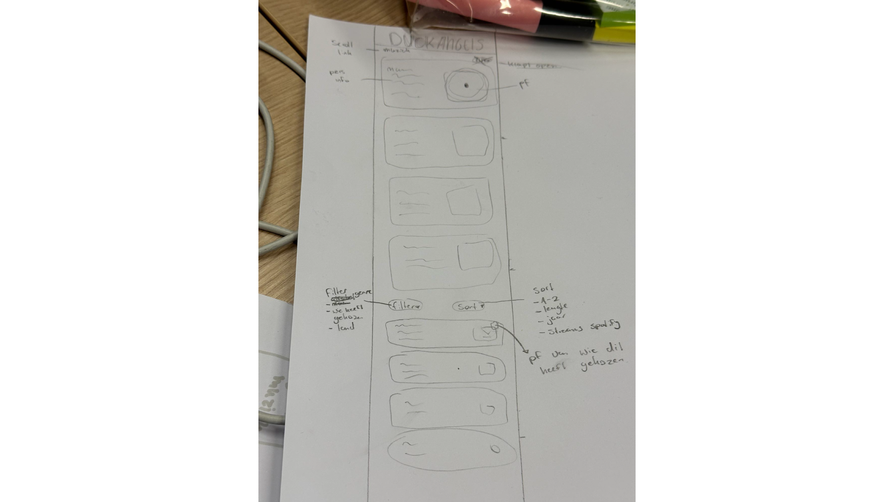
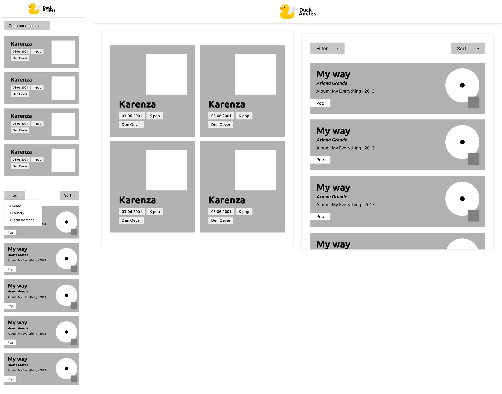
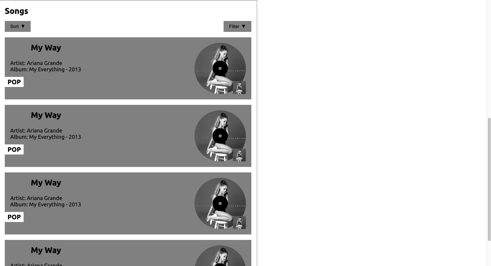
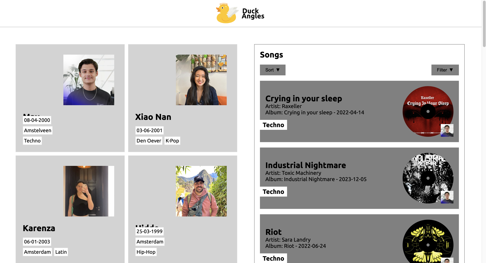
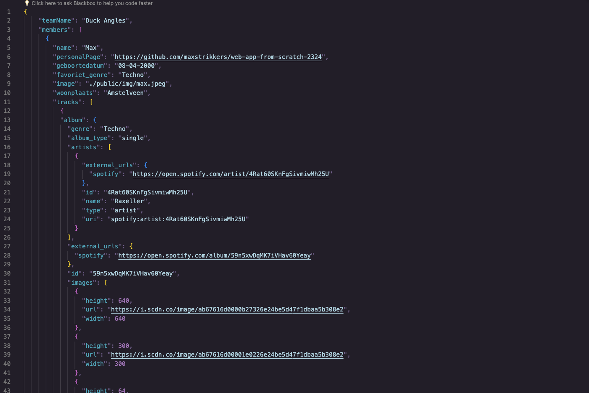
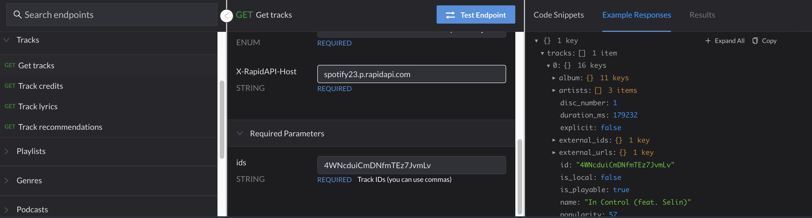

# DuckAngels

## Intro
Als team gaan we een app maken met data die van onze persoonlijke apps komen. We gingen als team bespreken wat elk team lid wil maken voor zijn persoonlijke app.

- Max: Muziek
- Karenza: Muziek
- Hidde: Film
- Xiao Nan: Eten

Als team hebben wij besloten om een app te maken over muziek. Het eerste idee is om een one pager te maken, elke section van elk teamlid met een intro van het favoriete genre van elk team lid en kleur en emoji.

## Trello
We hebben een trello bord aangemaakt waarbij we kunnen zien wat de planning is voor ons en wie wat doet.

Link: [Onze Trello](https://trello.com/b/X0KmrT8Y/duck-angles)

## Data op papier
We hebben op een blad opgeschreven welke data we nodig kunnen hebben. 

## Schets
We begonnen met het maken van een schets van onze eerste idee. Het idee is om te beginnen met cards van ons zelf als intro en daarna cards van nummers die vanuit de dataset komen. Die cards kan je filteren en sorteren. 

Van de schetsen is er een wireframe gemaakt van de mobiele versie en home versie.

## HTML CSS
Hidde en Karenza begonnen met het maken van de HTML en CSS. Hidde doet de muziek sectie en Karenza de Team sectie.

### Versie 1
**Members**

**Muziek**

Deze aanpassingen zijn gedaan op aparte branches. We gingen eerst de branche van team mergen met main. Daarna die van songs. Er waren conflicts met main maar die konden we makkelijk aanpassen. Wanneer de 2 branches waren gemerged was er een conflict met de styling. Articles waren los gezet zoals: article {} maar het moest zijn: .personeelInfo article {}. Dat was snel te zien waardoor het mergen en aanpassen niet lang duurde.

### Versie 2
Met wat styling aanpassingen en gefetchte data ziet de site er tot nu toe zo er uit:

## JSON

De dataset ziet er als volgt uit waarbij de teamleden in een array zitten met al de info van die persoon. 

Bij de tracks wordt de data van de Spotify Rapid API gebruikt. Hiervoor wordt elk liedje opgehaald met Get Tracks. Elk teamlid kiest 5 liedjes uit voor de dataset. Dan op Rapid API moet je de ID van het nummer via Spotify gebruiken om de nummers te krijgen. Dan kopiëren we de data die we krijgen van dat ene nummer en maken we handmatig een array van de 5 nummers bij elk teamlid.  

## UI stack

We zijn natuurlijk allemaal bezig geweest met de ideal state, maar we moeten natuurlijk ook rekening houden met de gebruiker. 
Als de data nog niet helemaal geladen is dan we een loading state.

